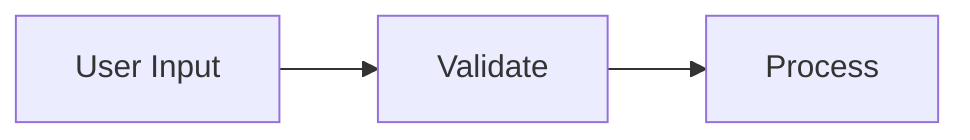
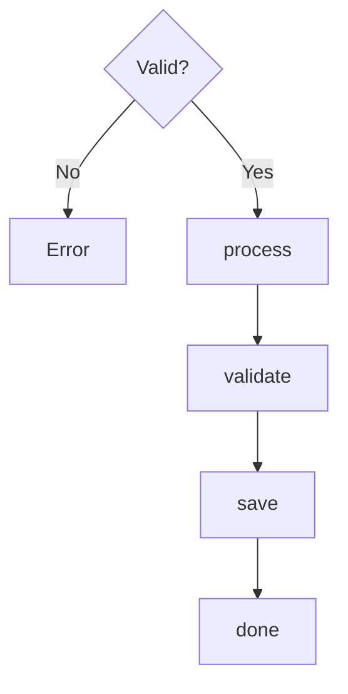
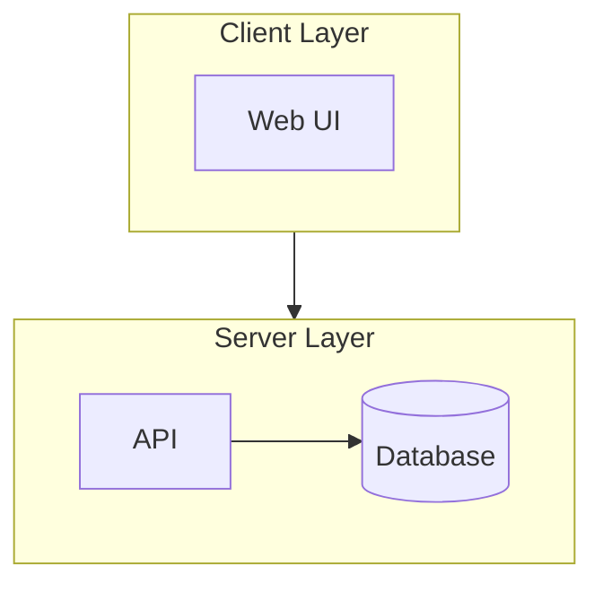
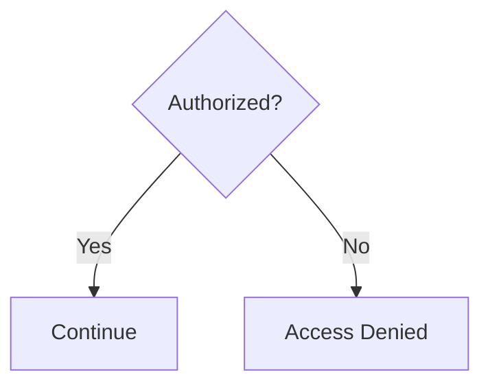
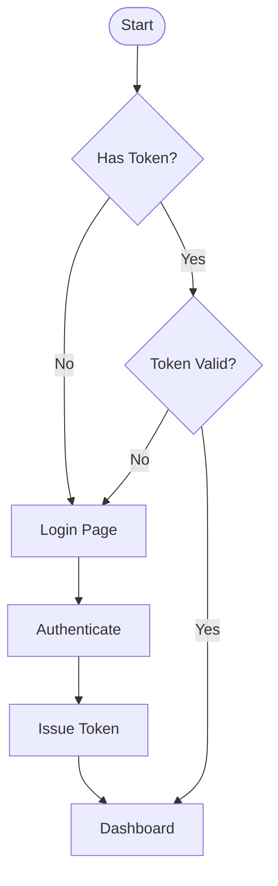
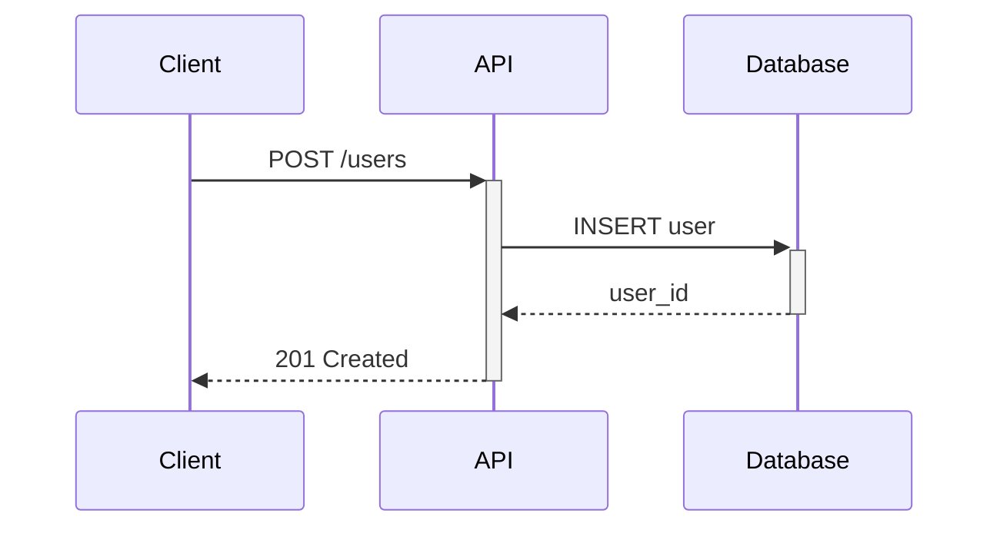
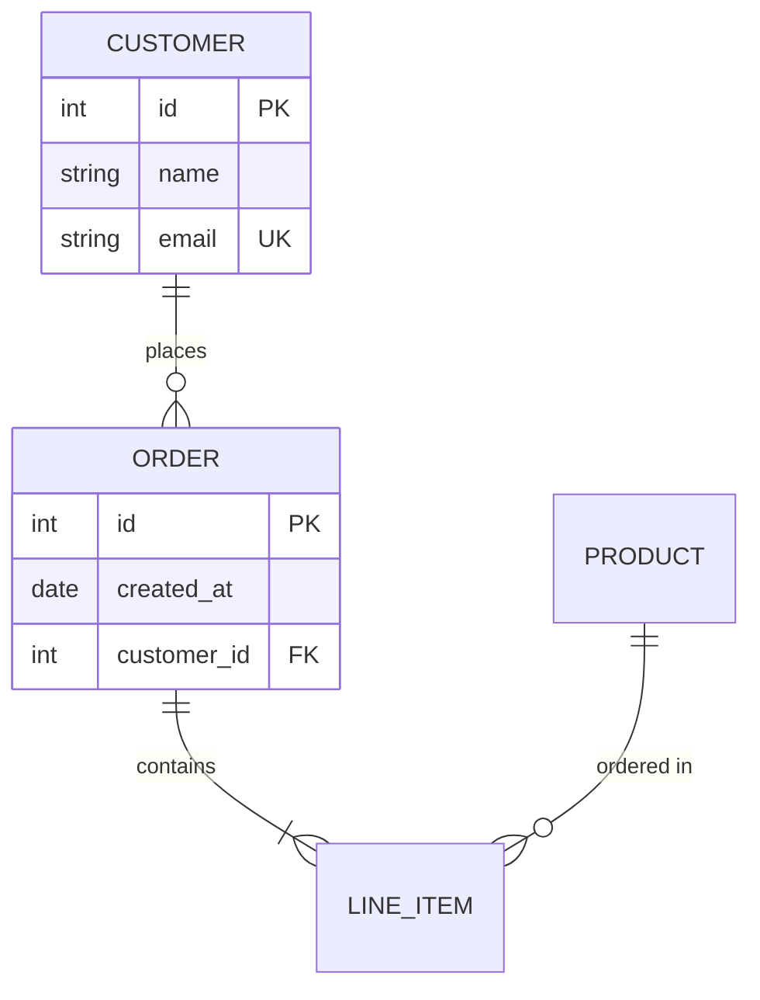

# Creating MermaidJS Diagrams

Creates well-structured, visually balanced MermaidJS diagrams.

## Workflow

Copy this checklist and track progress:

```
Diagram Progress:
- [ ] Step 1: Select diagram type
- [ ] Step 2: Plan layout direction
- [ ] Step 3: Write diagram code
- [ ] Step 4: Validate syntax
- [ ] Step 5: Review and refine
```

**Step 1: Select diagram type**

| Content | Type |
|---------|------|
| Process flow, decisions | `flowchart` |
| API calls, interactions | `sequenceDiagram` |
| OOP structure | `classDiagram` |
| Database schema | `erDiagram` |
| Lifecycle, transitions | `stateDiagram-v2` |
| Project schedule | `gantt` |

**Step 2: Plan layout direction**

- `TD` (top-down): Hierarchies, decision trees
- `LR` (left-right): Pipelines, timelines, workflows
- `BT`/`RL`: Inverted flows, RTL content

**Step 3: Write diagram code**

Follow the layout principles below. See `references/layout-guide.md` for advanced patterns.

**Step 4: Validate syntax**

```bash
node scripts/validate_mermaid.js diagram.mmd
node scripts/validate_mermaid.js --code "flowchart TD; A-->B"
```

**Step 5: Review and refine**

Address any warnings about readability or style.

## Layout Principles

### Use descriptive node IDs



### Balance branches

Place shorter branches first:



### Group with subgraphs



### Label decision branches



### Control spacing

- `--->` for longer links
- `<br>` for multi-line labels
- `~~~` for invisible alignment links

## Examples

**Input**: "Show a user authentication flow"

**Output**:


**Input**: "API request sequence"

**Output**:


**Input**: "Database schema for orders"

**Output**:


## Diagram Type Reference

See `references/diagram-types.md` for syntax of each diagram type.

## Advanced Layout

See `references/layout-guide.md` for:
- Subgraph direction overrides
- Hub-and-spoke patterns
- Pipeline layouts
- Fork-join patterns
- Layered architecture
