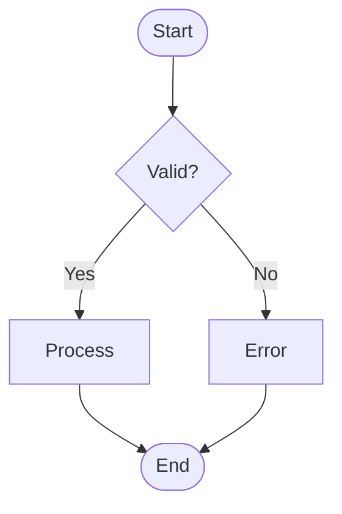
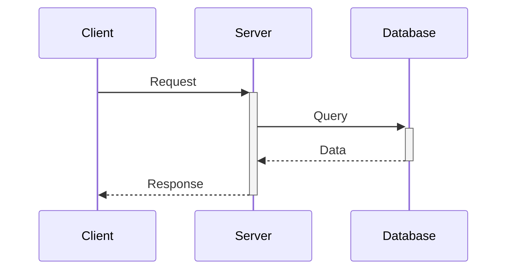
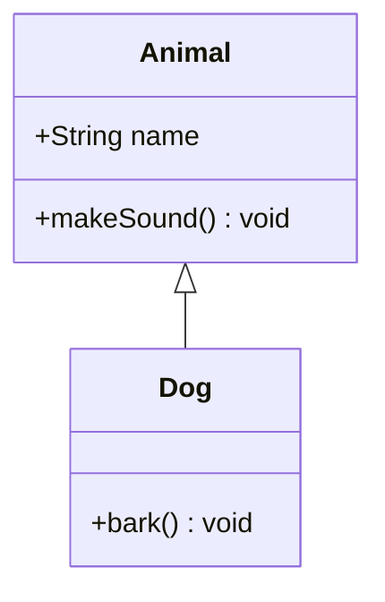
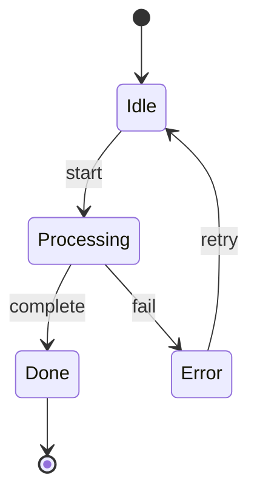
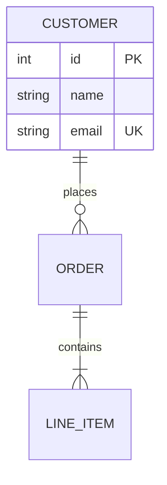
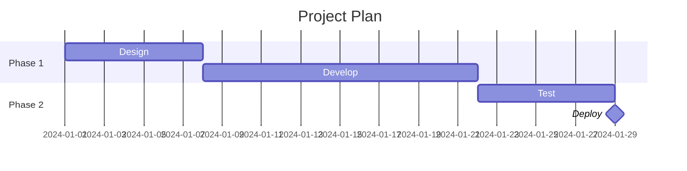
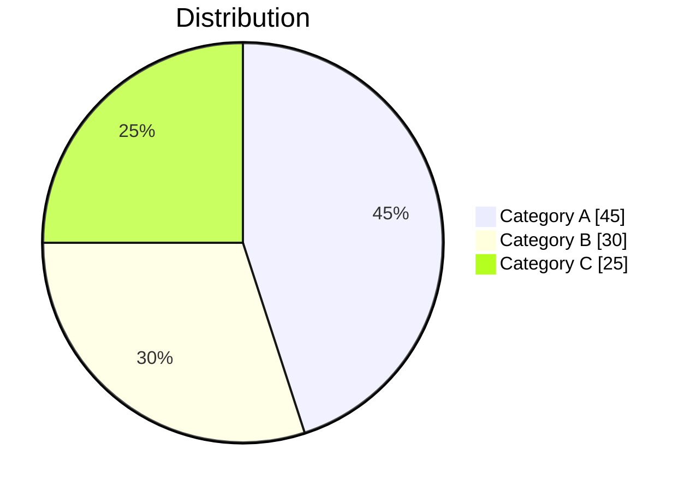
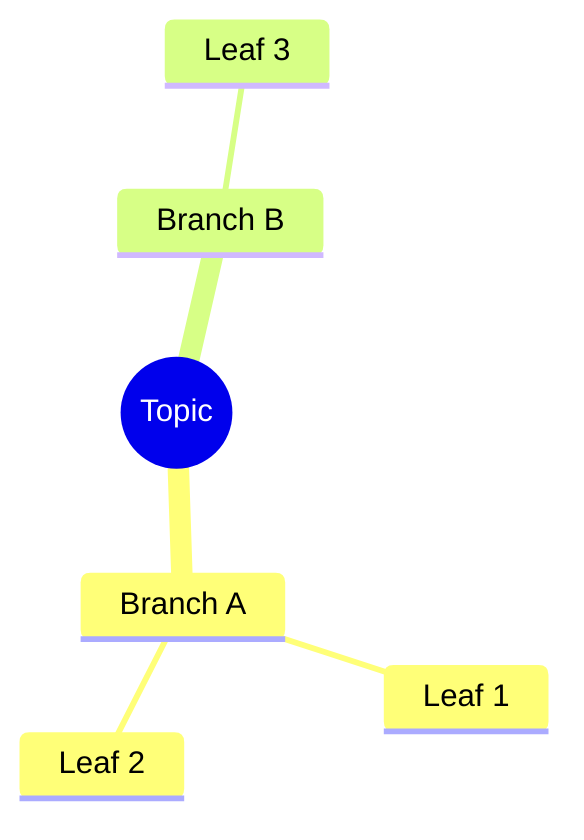
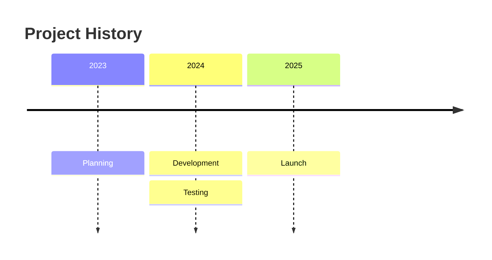
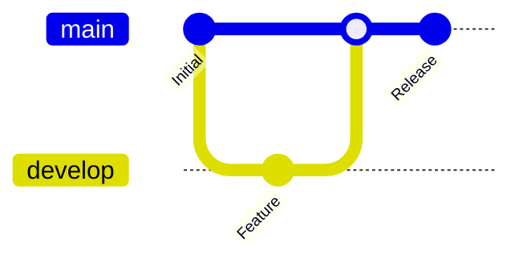

# MermaidJS Diagram Types Reference

Quick syntax reference for each diagram type.

## Contents

- [Flowchart](#flowchart)
- [Sequence Diagram](#sequence-diagram)
- [Class Diagram](#class-diagram)
- [State Diagram](#state-diagram)
- [ER Diagram](#er-diagram)
- [Gantt Chart](#gantt-chart)
- [Pie Chart](#pie-chart)
- [Mindmap](#mindmap)
- [Timeline](#timeline)
- [Git Graph](#git-graph)

---

## Flowchart

**Directions:** `TD` (top-down), `LR` (left-right), `BT` (bottom-top), `RL` (right-left)

**Node shapes:**
- `[text]` Rectangle
- `(text)` Rounded
- `{text}` Diamond
- `([text])` Stadium
- `[(text)]` Cylinder
- `((text))` Circle

**Arrows:**
- `-->` Arrow
- `---` Line
- `-.->` Dotted
- `==>` Thick
- `-->|label|` Labeled

---

## Sequence Diagram

**Arrows:**
- `->` Solid line
- `-->` Dotted line
- `->>` Solid with arrowhead
- `-->>` Dotted with arrowhead
- `->>+` Activate target
- `-->>-` Deactivate target

**Blocks:** `alt`, `opt`, `loop`, `par`, `critical`, `rect`

---

## Class Diagram

**Relationships:**
- `<|--` Inheritance
- `*--` Composition
- `o--` Aggregation
- `-->` Association
- `..>` Dependency

**Visibility:** `+` public, `-` private, `#` protected

---

## State Diagram

**Special states:**
- `[*]` Initial/final state
- `state "Name" as alias` State with description

---

## ER Diagram

**Cardinality:**
- `||` Exactly one
- `o|` Zero or one
- `}|` One or more
- `}o` Zero or more

---

## Gantt Chart

**Task modifiers:** `active`, `done`, `crit`, `milestone`

---

## Pie Chart

---

## Mindmap

---

## Timeline

---

## Git Graph

