# MermaidJS Layout Guide

Advanced layout strategies for visually balanced diagrams.

## Contents

- [Direction Strategy](#direction-strategy)
- [Node Arrangement](#node-arrangement)
- [Subgraph Layout](#subgraph-layout)
- [Spacing Techniques](#spacing-techniques)
- [Common Patterns](#common-patterns)
- [Sequence Diagram Layout](#sequence-diagram-layout)

---

## Direction Strategy

| Direction | Best For | Aspect |
|-----------|----------|--------|
| `TD` | Hierarchies, decisions | Portrait |
| `LR` | Pipelines, timelines | Landscape |
| `BT` | Inverted org charts | Portrait |
| `RL` | RTL content | Landscape |

---

## Node Arrangement

### Balanced Branching

Shorter branches first for visual balance:

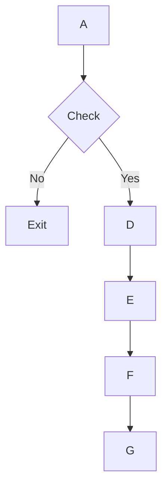

### Parallel Paths

Use `&` for simultaneous connections:

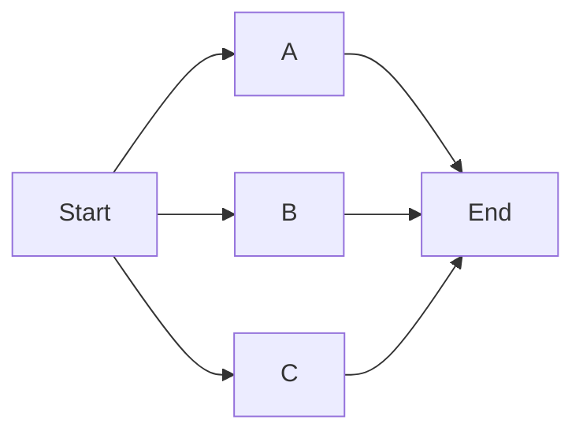

### Minimize Crossings

Reorder node declarations to reduce line crossings. Nodes declared first appear in earlier positions.

---

## Subgraph Layout

### Direction Override

Override parent direction inside subgraphs:

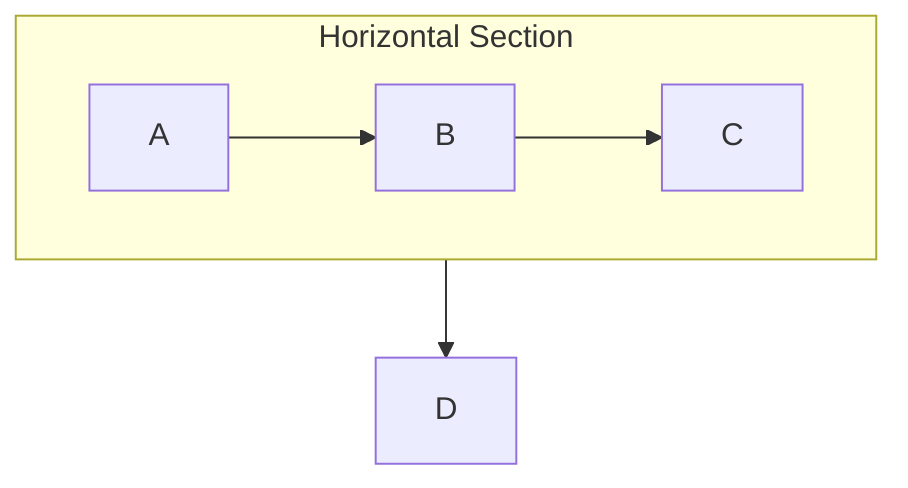

### Nested Subgraphs

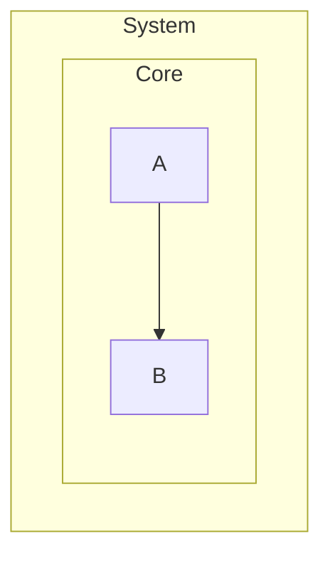

### Styling Subgraphs

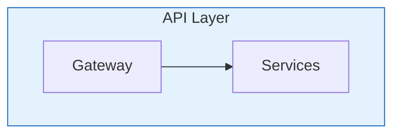

---

## Spacing Techniques

### Link Length

Extra dashes for longer links:

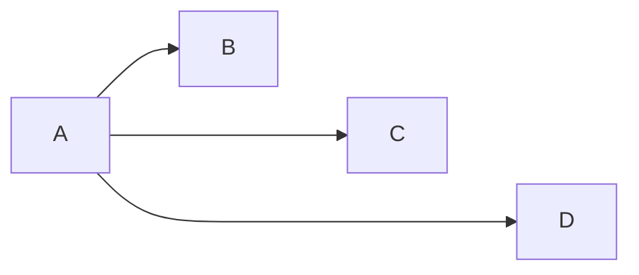

### Multi-line Labels

Use ` ` for line breaks:

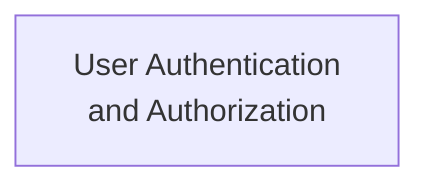

### Invisible Links

Use `~~~` for alignment without visible connections:

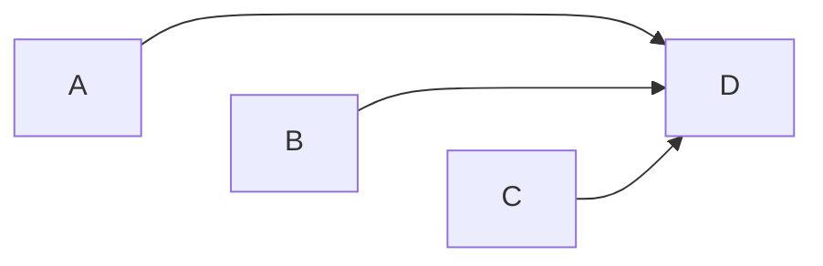

---

## Common Patterns

### Pipeline

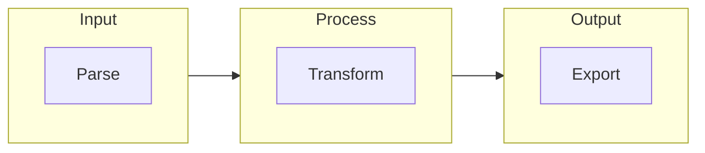

### Hub and Spoke

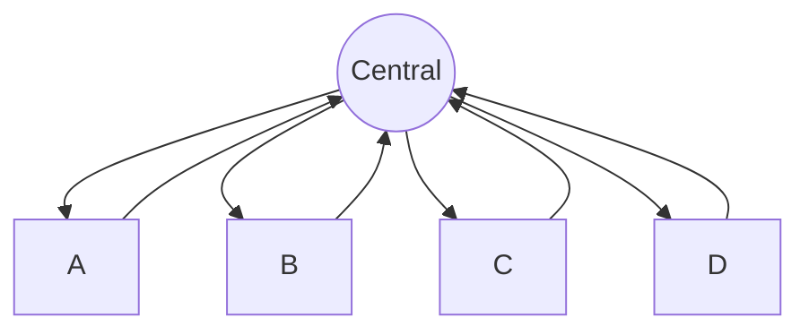

### Fork-Join

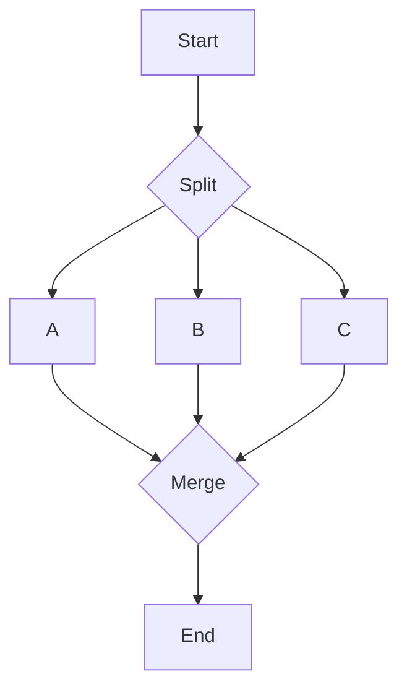

### Layered Architecture

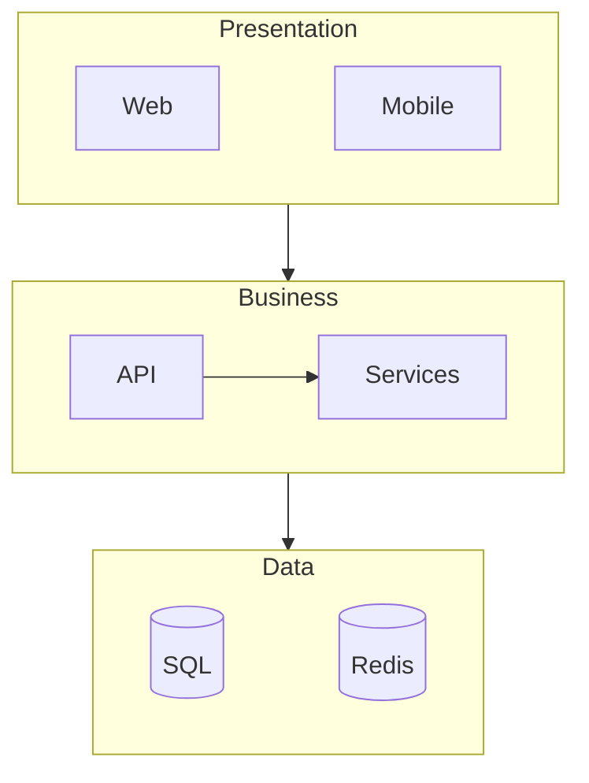

---

## Sequence Diagram Layout

### Participant Ordering

Order left-to-right by interaction flow (initiator → responder):

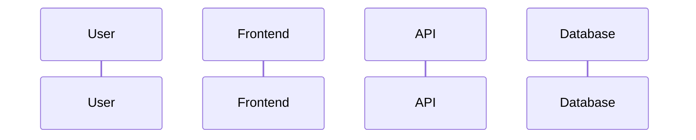

### Activation Boxes

Show processing duration:

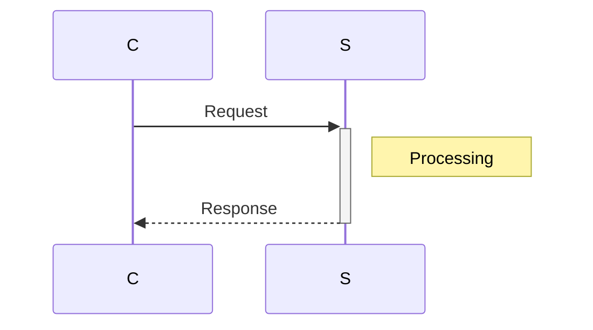

### Visual Grouping

Use `rect` for sections:

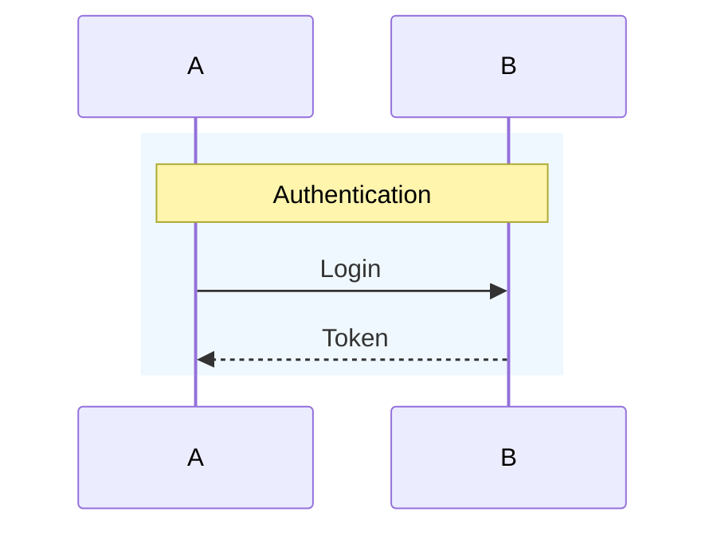
